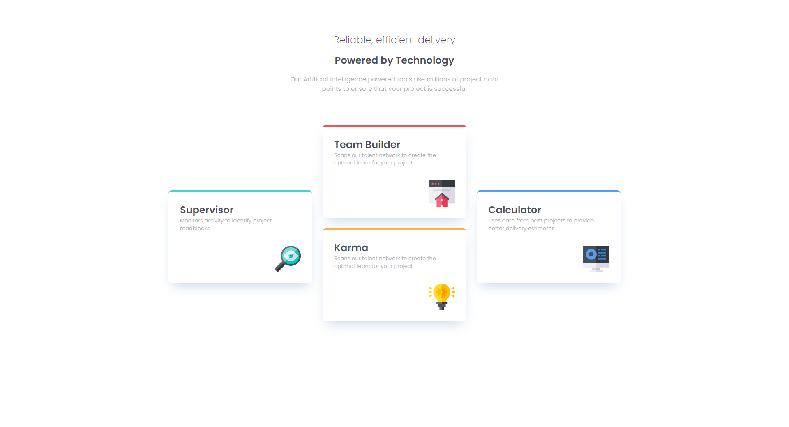

# Frontend Mentor - Four card feature section solution

This is a solution to the [Four card feature section challenge on Frontend Mentor](https://www.frontendmentor.io/challenges/four-card-feature-section-weK1eFYK). Frontend Mentor challenges help you improve your coding skills by building realistic projects. 

## Table of contents

- [Overview](#overview)
  - [The challenge](#the-challenge)
  - [Screenshot](#screenshot)
  - [Links](#links)
- [My process](#my-process)
  - [Built with](#built-with)
  - [What I learned](#what-i-learned)
  - [Continued development](#continued-development)
  - [Useful resources](#useful-resources)
- [Author](#author)
- [Acknowledgments](#acknowledgments)

## Overview

### The challenge

Users should be able to:

- View the optimal layout for the site depending on their device's screen size

### Screenshot

### Links

- Solution URL: [Four Card Feature](https://github.com/cloudpc7/fourcardfeature.git)
- Live Site URL: [Four Card Feature](https://fourcardfeature-lime.vercel.app/)

## My process
Started out creating html page
Created a CSS reset page. 
Style the mobile section first using CSS Responsive Web Design
Created media queries to show case desktop image

### Built with

- Semantic HTML5 markup
- CSS custom properties
- Flexbox
- CSS Grid
- Mobile-first workflow

### What I learned

I learned a lot more about CSS Responsive design. I was able to learn more about media queries and the sizing of certain components.
I know I have more to learn but this was a big step forward and it greatly enhanced my abilities to create front end applications. 

### Continued development
I will continue to learn about responsive design and mobile design. I feel that I can do a lot more when I put mobile design first 
and work from the ground up. 

### Useful resources
[Fronte End Mentor](https://frontendmentor.io)
[Kevin Powell](www.youtube.com/@KevinPowell)

## Author

- Website - [Paul Cloud](https://github.com/cloudpc7)
- Frontend Mentor - [@yourusername](https://www.frontendmentor.io/profile/cloudpc7)
-

## Acknowledgments

I would like to acknowledge frontend mentor for coming up with a website that provides people like me to learn more hands on 
approaches and techniques for learning front end development. Thank you

I would also like to acknowledge Kevin Powell for creating content on youtube that gave me more knoweldge on how to create
responsive web designs. 